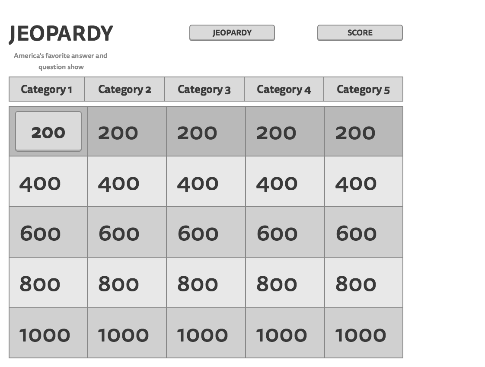
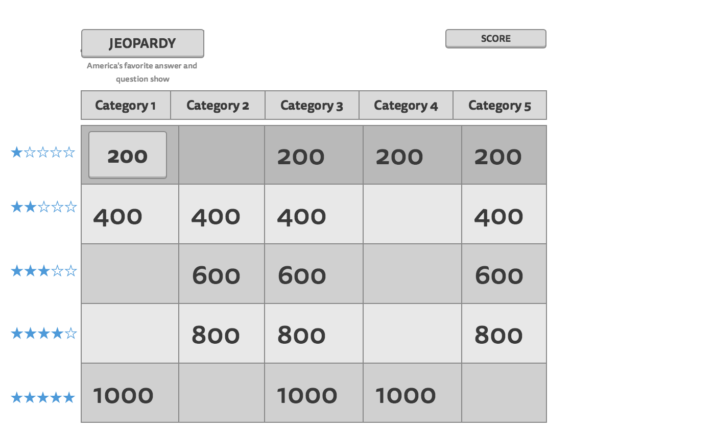

# wdi-project01-jeopardy

# Jeopardy Project
## Overview

For project #1, I created an intricate self-shuffling replica of the television show Jeopardy. 

The game generates as soon a user enter the page. From there, they can begin to answer multiple-choice questions from various categories. The board will generate 6 six category that each feature 5 clues of increasing difficulty and point value. Given the point value of the clues and the validity of the user's response, the game will proceed to either increase or decrease the user's score. The game will continue until all of the available questions have been answered. The user will either be presented with a congratulations or a disapproving message given that their final score is positive or negative. A reset button will appear allowing th user to generate a new board.

**Live site:** <http://nostalgic-babbage-5bbb89.bitballoon.com/>

## Technologies Used

  * Languages - HTML5, CSS3, Javascript, jQuery
  * Design - MockingBird (for the wireframe images), Google Fonts
  * Project Planning & User Stories - [Trello](https://trello.com/b/0VJWUujp/project-1-jeopardy)
  * Studio Visual Code

## Features

  * Scoreboard (unresponsive)

## Wireframe

## Winning Combination

##Other Planning References
(images/IMG-1310.JPG)
(images/IMG-1311.JPG)
(images/IMG-1312.JPG)
(images/IMG-1313.JPG)
(images/IMG-1314.JPG)
(images/IMG-1315.JPG)

## Future Development

  * Make it actually work
  * Make it responsive
  * Add a second round with a new set of categories.
  * Add a final question
  * Add dynamic themes
  * Add Daily Double feature

